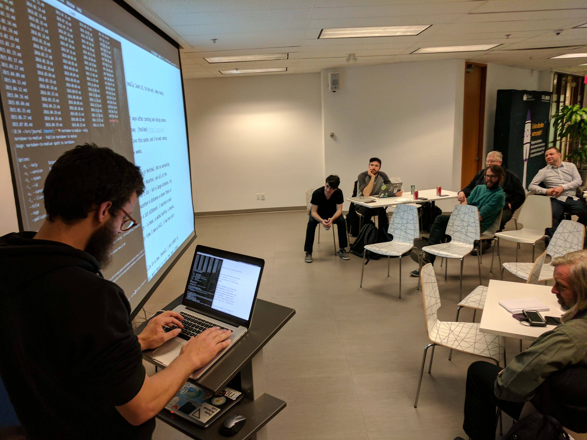

# Letters from Richard: Keep it Public, Hugo, NodeSchool, and Travels

Hey all!

Another week, a few new things to talk about.

---

## Website: [Keep It Public](https://keepitpublic.org)

[Keep It Public](https://keepitpublic.org) is a nonprofit that I have been working with for the past couple of months. I contacted them asking if they needed any technical help. I have some experience here - I used to work at [Hipcamp](http://hipcamp.com/), a site for discovering campsites, and I built [accessland.org](http://accessland.org) with them, a website for aa coalition of 50+ organizations committed to increasing access to public land through open data.

Greg and Patrick are great guys who are working hard ensuring that our public lands stay open, and don't get bought up or sold. What I find refreshing is that they're reaching out to both sides of the aisles; left and right, hunters and hikers.

Mostly, my help has been setting up Squarespace and Stripe account integrations. You can now donated directly to their 501c3. It's tax deductible.

## To Read: [Getting Hugo Running on Netlify](https://medium.com/@richlitt/getting-hugo-running-on-netlify-947eb00a2cbd)

I wrote this describing my process for getting Hugo up and running using Netlify, one of my favorite site providers. There are a few tricks to the process. Netlify liked it so much they're sending me a free shirt. So, that's cool.

> Running Hugo on Netlify is satisfyingly great. You can get a static website running with almost no operating costs (unless you’re at major scale), and you’re also able to quickly deploy by pushing to GitHub, as well as getting SSL through LetsEncrypt automatically at the push of a button. All told, you can have a website up and running in around 30 minutes from domain purchase. It’s fast.

[Read more here](https://medium.com/@richlitt/getting-hugo-running-on-netlify-947eb00a2cbd)

## To Use: [NodeSchool](https://nodeschool.io/)

[NodeSchool](https://nodeschool.io/) is a great way to learn about Node. By downloading and running their workshoppers, you can teach yourself about back end JavaScript super fast. NodeSchools pop up everywhere - they're basically meetups where people go through the workshopppers, and ask for help if they need it. I mentored at the last two [NodeSchool Montréal](https://nodeschool.io/montreal/) events. Lots of fun! Here's me giving a talk about how to get involved with open source.

## To Watch: [History of Public Lands](https://www.youtube.com/watch?v=rC_mnRu-4gA)

Keep It Public made this video about the history of public lands. I did not know a lot of this!

## Ask

Anyone in Boston, Berlin, Edinburgh, or Poland? I'll be in Boston tomorrow, Berlin on Wednesday (for a few weeks), Edinburgh from May 12th-25th (excepting a trip to the highlands), and Warsaw on May 25th. I'll probably hitch back across the continent and through the UK after that.

If you want to say hi, let me know!

---

That's all! Enjoy your weekend and take care, folks!

If you have any thoughts, just hit reply; I'll respond to every email I get here.

Best,
Richard

Montréal, Canada.
