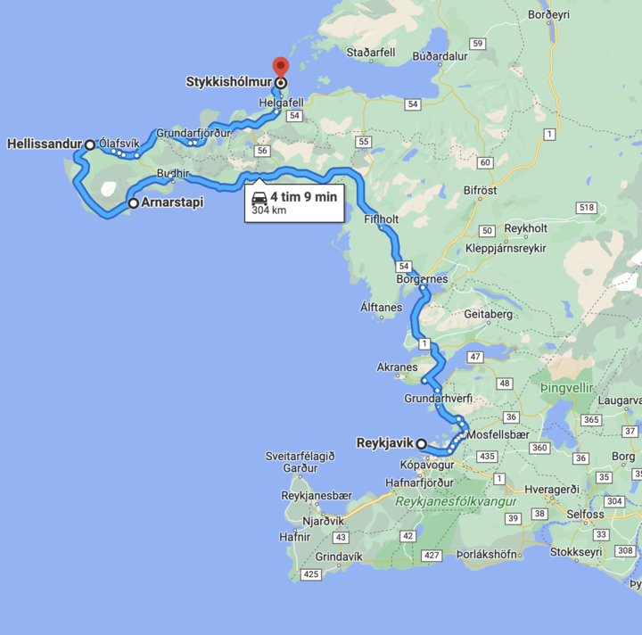
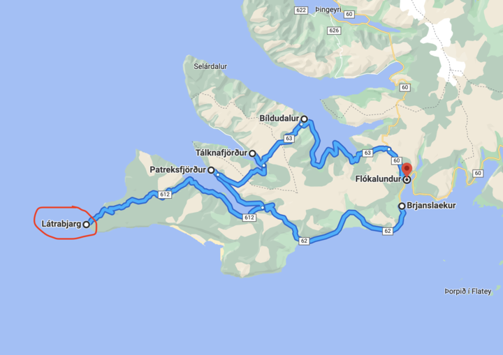
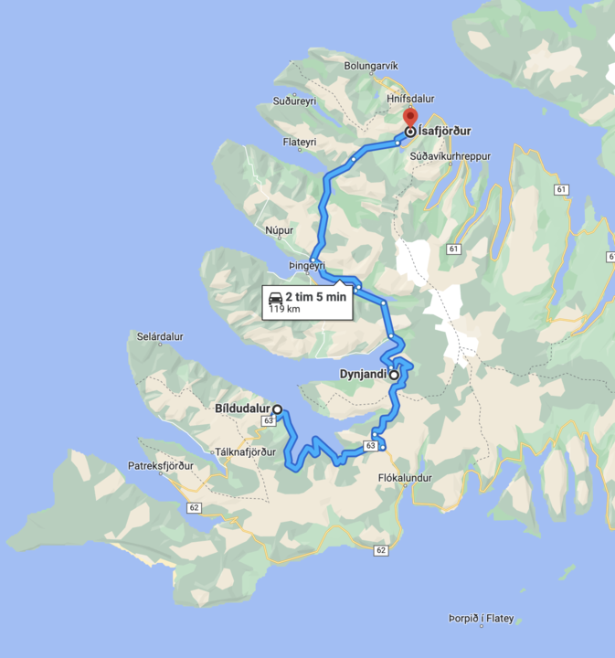
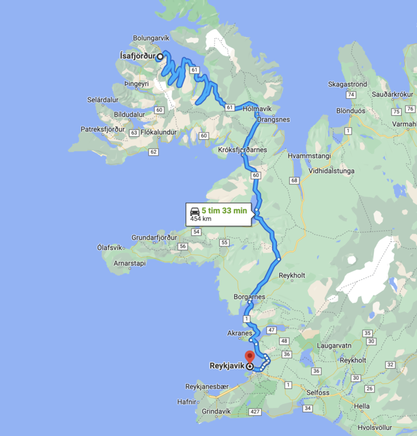

# Going to Iceland

First, there's a Mountain Goats song for this: https://themountaingoats.fandom.com/wiki/Going_to_Reykjavik

I have been to Iceland! But I also have a different experience of being there than the average person - one of my best friends lives there. So, I didn't end up doing a lot of touristy things, but mostly just drove around with my friend. That having been said, I think there are some great things to do.

Grottatangur and [the Bakkatjörn pond](https://ebird.org/hotspot/L743344) are excellent birding spots, right in downtown Reykjavik. Grottatangur is also a great place to visit - they open it very occasionally, I believe. I like it there. As well, [the downtown Tjörnin pond](https://ebird.org/hotspot/L1025679) is excellent for birds, too. I got my lifer Pink-footed Goose there.

Outside of the city (there's only one city), [Mógilsá](https://ebird.org/hotspot/L1488633) is an excellent place for a walk, in amongst what almost passes for a forest in Iceland. There's a sweet cafe, too, for afterwards. Iceland has an endemic Red Crossbill subspecies, which is great, and they can sometimes be seen there. Also, Common Snipe! Just walk around and see if you can kick them up. Don't drive underneath Hvalfjörður, go around it - it's worth the extra drive, as it's quite pretty (unless you're driving around the whole island, in which case you'll see this again). I quite liked the little town of Bogarnes, and there are some great restaurants. Even better, past it, is [Landbrotolaug](https://ebird.org/hotspot/L7105823) - a natural hotspring the size of a hottub smack-dab in the middle of an icy field of nothingness. Can't suggest it enough, one of my favourite places on earth. No idea why. Bring whisky. I got my lifer Rock Ptarmigan there. I would probably suggest going further to the fjords in the northeast, but I've never made it that far. In the south, you might want to check out the majestic cliffs of [Krysuvíkurberg](https://ebird.org/hotspot/L3751875). They're quite beautiful. Never drive off-road in Iceland - huge fines. Stay on the dirt tracks that are clearly there.

There are puffins, but I've never seen one. I always seem to visit in winter.

If you like folk music, let me know. I can connect you to a local session.

That's really the limit of my experience there. I wish I had more to offer! I've mostly just... driven around with my friend, hung out downtown, had a few drinks, and chased birds on my eBird alerts. :) I love Iceland. Hitching from the airport into town is easy, but, to be honest, you should rent a car if you can while you're there. It's so much easier to get out of Reykjavik, and so much cooler once you've done so.

## Westfjords

_The following is from my friend Hugi. I haven't been here yet._

My recommendation, if departing from Reykjavík:
- Start the day early at 8 AM, drive from Reykjavik and take the scenic route around the Snæfellsnes peninsula to Stykkishólmur. Spend that day exploring that peninsula, stopping wherever you see cool stuff. Definitely make sure to drive all the way around the peninsula, through the national park. End at Stykkishólmur and spend the night there.
- Next morning take the car ferry across from Stykkishólmur to Brjánslækur. Drive the circle around that peninsula, and make sure to schedule at least 3-4 hours for the drive to Látrarbjarg and back. Make sure to look on Google maps to find the hot springs (open air freely accessible natural thermal baths).
- Next day, drive north towards Ísafjörður and make sure to plan a stop at Dynjandi cascading waterfalls. Staying at Ísafjörður is nice, it’s a weird and cozy little town.

Having a good time in Iceland is also about adapting to the weather, so make sure to check forecasts before heading out. For example, the roads out to Látrarbjarg are pretty rough. We drove them on a 20 year old Volkswagen, and it was fine on a sunny day, but we would have been in trouble if there had been a sudden change in weather.

